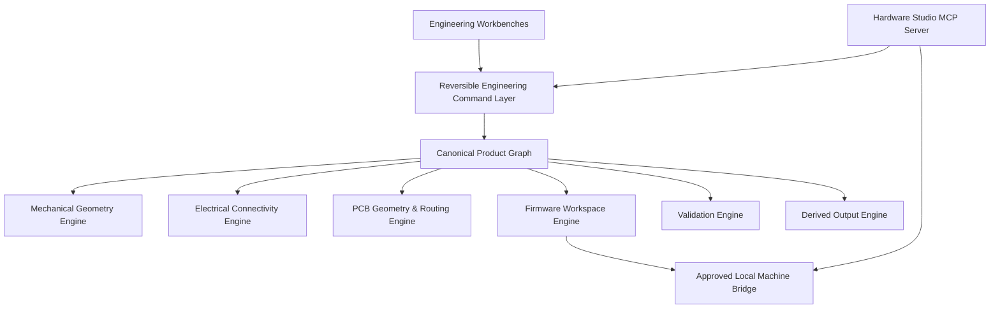

<div align="center">

# Hardware Studio

### Design the whole product—not disconnected files.

**An experimental engineering workspace by System Alpha**

[Explore the development build](https://hardware-studio.vercel.app/studio) · [Read the product vision](docs/PRODUCT_VISION.md) · [See current status](docs/CURRENT_STATUS.md) · [View the roadmap](docs/ROADMAP.md)

</div>

---

> [!WARNING]
> **Hardware Studio is not ready for production use.** The base engineering engines and several cross-domain workflows are still incomplete. Current PCB, mechanical, firmware, validation, blueprint, and manufacturing outputs must not be used directly for fabrication, certification, safety decisions, or production hardware.

## What is Hardware Studio?

Hardware Studio is an attempt to build a unified operating environment for designing, validating, and releasing complete physical products.

Modern hardware development is fragmented across CAD files, schematic and PCB projects, firmware repositories, spreadsheets, supplier portals, test documents, release folders, and manufacturing packages. Important relationships are usually maintained manually—or lost entirely.

Hardware Studio is being designed around a different model:

> **One durable product graph shared by every engineering workbench.**

The long-term goal is to connect:

```text
Product requirements
        ↓
System architecture and interfaces
        ↓
Mechanical geometry and assemblies
        ↓
Components, schematic, and PCB
        ↓
Firmware mappings and source
        ↓
Validation evidence and retests
        ↓
Blueprints, manufacturing, and releases
```

It is inspired by the depth of tools such as Autodesk Fusion, KiCad, Altium, Onshape, PlatformIO, FreeCAD, and product lifecycle systems—but it is **not currently a replacement for any of them**.

## The core idea: one product graph

A component should not exist as unrelated records in multiple tools. It should be one connected engineering entity with links to its:

- requirement and system role
- architecture block and interfaces
- schematic symbol and electrical pins
- PCB footprint, pads, placement, nets, traces, and rules
- 3D package and mechanical clearance envelope
- BOM, sourcing, lifecycle, and alternatives
- firmware driver, protocol, and pin mapping
- power and thermal assumptions
- validation tests, measurements, and evidence
- release and manufacturing status

Eventually, replacing a component should expose the effects across the complete product instead of silently breaking downstream files.

## Planned workbenches

### Product

Requirements, system architecture, interfaces, risks, decisions, and requirement coverage.

### Mechanical

2D layouts, enclosure intent, assembly stacks, dimensions, lightweight constraints, clearances, 3D visualization, and future parametric geometry.

### Electronics

Component definitions, symbols, pins, nets, schematic connectivity, PCB footprints, board layouts, routing, DRC/ERC, and manufacturing drafts.

### Firmware

Hardware mappings, state machines, source files, generated code, PlatformIO configuration, builds, uploads, serial monitoring, and test links.

### Validate

EVT, DVT, PVT, factory QA, measurements, evidence, retests, immutable run history, and requirement coverage.

### Release

Named revisions, branches, comparisons, approvals, blueprints, manufacturing packages, release candidates, and immutable releases.

## Intended architecture



The project is intended to work in two directions:

1. **Hardware Studio as an MCP server** — allowing approved AI clients to inspect and operate the product through semantic engineering tools.
2. **Hardware Studio as an MCP host/client** — connecting to external engineering tools, supplier systems, local devices, and future adapters.

MCP actions should represent real operations such as `add_component`, `connect_component_pins`, `route_net`, `build_firmware`, or `create_validation_run`—not mouse-coordinate automation.

## What exists today

The repository currently contains early foundations for:

- a multi-workbench browser application
- a canonical local project model and project persistence
- product requirements and architecture surfaces
- mechanical 2D and WebGL workbenches
- component, schematic, PCB, and design-review foundations
- firmware modules, state machines, and source-file foundations
- validation tests and run-engine foundations
- revision, release, blueprint, and manufacturing-draft foundations
- a local PlatformIO bridge foundation
- an MCP server foundation
- readiness scoring and project exports

These are active development systems. Some workflows are real, some are partial, and some remain architectural foundations.

## What is not ready

The following areas still require substantial production work:

- complete pointer-correct undo/redo across every editor
- robust polygon, dimension, constraint, and parametric mechanical workflows
- fully anchored PCB traces and a true electrical connectivity graph
- comprehensive DRC/ERC and strict multi-board isolation
- canonical 3D geometry without guessed package or board dimensions
- complete PlatformIO operations, serial monitoring, cancellation, and durable operation history
- validation execution, measurement tolerances, evidence review, retest comparison, and UI
- real branch switching, merging, conflicts, and immutable release workflows
- MCP connection to the live durable application project and typed command execution
- fabrication-grade manufacturing outputs
- complete CI coverage for the application, bridge, and MCP packages

See [Current Status](docs/CURRENT_STATUS.md) for the maintained status model.

## Product principles

### Truthful engineering state

Hardware Studio must never mark a workflow complete simply because a type, test, button, or document exists. Status should derive from real project state and verified production behavior.

### Local-first direction

Projects should remain usable locally. Machine-level operations should be mediated through an authenticated loopback bridge with explicit approvals for high-impact actions.

### Reversible by default

Engineering changes should be versioned, reviewable, undoable, and traceable—whether initiated through the UI or through MCP.

### Intent-driven operations

The system should expose semantic engineering actions instead of depending on brittle browser or mouse automation.

### One source of product truth

Every workbench should operate on the same canonical project document, with migrations and deterministic derived outputs.

## Development build

The public landing page is available at:

```text
https://hardware-studio.vercel.app/
```

The experimental workspace is available at:

```text
https://hardware-studio.vercel.app/studio
```

The development build is provided for exploration only. It is not a stable release.

## Run locally

### Requirements

- Node.js 20 or newer
- npm
- PlatformIO CLI only when testing local firmware operations

### Install and run

```bash
npm install
npm run dev
```

Open:

```text
http://localhost:3000
```

The studio route is:

```text
http://localhost:3000/studio
```

### Verification commands

```bash
npm run lint
npm run typecheck
npm test
npm run build
```

The current repository does not yet provide complete dedicated MCP and bridge build/test scripts. These remain part of the roadmap.

## Repository map

```text
src/app/                     Next.js routes and public landing page
src/components/              Product and engineering workbenches
src/store/                   Canonical project state and command history
src/lib/                     Engineering engines, validation, exports, and utilities
src/types/                   Shared product-domain models
packages/local-bridge/       Approved local machine operations
packages/mcp-server/         Model Context Protocol foundation
docs/                        Vision, architecture, roadmap, status, and development notes
```

## Documentation

- [Product Vision](docs/PRODUCT_VISION.md)
- [System Architecture](docs/ARCHITECTURE.md)
- [Current Status](docs/CURRENT_STATUS.md)
- [Roadmap](docs/ROADMAP.md)
- [Safety and Limitations](docs/SAFETY_AND_LIMITATIONS.md)
- [Contributing](CONTRIBUTING.md)
- [V1 Execution Ledger](docs/development/V1_EXECUTION_LEDGER.md)

## Safety and fabrication notice

Hardware Studio currently generates planning artifacts and manufacturing drafts. These outputs require:

- independent electrical engineering review
- independent mechanical engineering review
- a real Gerber/CAM viewer inspection
- fab-house DFM validation
- verified component footprints and package geometry
- physical prototype testing
- applicable regulatory and safety review

Never submit current generated output directly to manufacturing without qualified review.

## Project status

**Stage:** Research and active development  
**Release status:** No stable production release  
**Primary goal:** Build a truthful connected foundation before presenting the platform as complete  
**Maintainer:** [Ankit Bhardwaj](https://github.com/Ankit6149) / System Alpha

## Contributing

Thoughtful engineering feedback is welcome, especially around:

- product-graph architecture
- geometry and electrical connectivity engines
- PCB routing and DRC/ERC
- local-first storage and revision systems
- firmware and PlatformIO integration
- validation and manufacturing workflows
- MCP tool design and safety

Read [CONTRIBUTING.md](CONTRIBUTING.md) before opening changes.

---

<div align="center">

**Hardware Studio by System Alpha**

Building toward one connected environment for the complete physical-product lifecycle.

</div>
