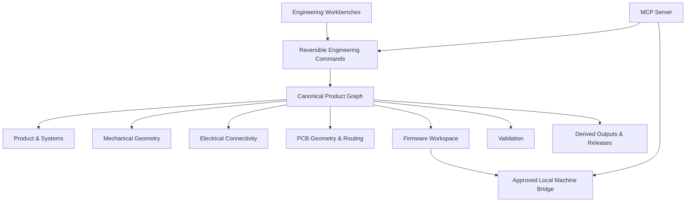

<div align="center">


# Hardware Studio

### Design the whole product—not disconnected files.

**An experimental, local-first engineering workspace by [Ankit Bhardwaj](https://github.com/Ankit6149)**

[Landing page](https://hardware-studio.vercel.app/) · [Development workspace](https://hardware-studio.vercel.app/studio) · [Product vision](docs/PRODUCT_VISION.md) · [Current status](docs/CURRENT_STATUS.md) · [Roadmap](docs/ROADMAP.md)

</div>

---

> [!WARNING]
> **Hardware Studio is not ready for production use.** The base engineering engines and several cross-domain workflows are incomplete. Current PCB, mechanical, firmware, validation, blueprint, and manufacturing outputs must not be used directly for fabrication, certification, safety decisions, or production hardware.

## Overview

Hardware Studio is an attempt to build one operating environment for designing, validating, and releasing complete physical products.

Hardware development is usually fragmented across mechanical CAD, schematic and PCB tools, firmware repositories, spreadsheets, test documents, supplier portals, revision folders, and manufacturing packages. Important relationships are maintained manually—or lost entirely.

Hardware Studio explores a different model:

> **One durable product graph shared by every engineering workbench.**

```text
Product requirements
        ↓
System architecture and interfaces
        ↓
Mechanical geometry and assemblies
        ↓
Components, schematic, and PCB
        ↓
Firmware mappings and source
        ↓
Validation evidence and retests
        ↓
Blueprints, manufacturing, and releases
```

The project is inspired by the depth of Autodesk Fusion, KiCad, Altium, Onshape, PlatformIO, FreeCAD, and product-lifecycle systems—but it is **not currently a replacement for any of them**.

## At a glance

| Area | Direction | Current state |
|---|---|---|
| Product | Requirements, architecture, interfaces, risks, traceability | Foundation |
| Mechanical | 2D layout, enclosure intent, assemblies, dimensions, 3D coordination | Partial |
| Electronics | Components, symbols, nets, schematic, PCB, ERC and DRC | Partial |
| Firmware | Hardware mapping, state machines, source, PlatformIO workflows | Partial |
| Validation | EVT, DVT, PVT, evidence, measurements, retests | Partial |
| Release | Revisions, branches, blueprints, factory packages, approvals | Partial |
| MCP | Typed, reviewable engineering operations over the live product | Foundation |

Detailed reality—not promotional status—is maintained in [Current Status](docs/CURRENT_STATUS.md).

## The core idea: one product graph

A component should not exist as unrelated records in different tools. It should be one connected engineering entity with links to its:

- requirement and system role
- architecture block and interfaces
- schematic symbol and electrical pins
- PCB footprint, pads, placement, nets, traces, and rules
- 3D package and mechanical clearance envelope
- BOM, sourcing, lifecycle, and alternatives
- firmware driver, protocol, and pin mapping
- power and thermal assumptions
- validation tests, measurements, and evidence
- release and manufacturing state

Eventually, replacing one component should reveal the effects across the complete product instead of silently breaking downstream files.

## Workbenches

### Product

Requirements, system architecture, interfaces, constraints, risks, decisions, and requirement coverage.

### Mechanical

2D layouts, enclosure intent, assembly stacks, dimensions, lightweight constraints, clearances, WebGL visualization, and future parametric geometry.

### Electronics

Component definitions, symbols, pins, nets, schematic connectivity, PCB footprints, board layouts, routing, DRC/ERC, and manufacturing drafts.

### Firmware

Hardware mappings, state machines, source files, generated code, PlatformIO configuration, builds, uploads, serial monitoring, and validation links.

### Validate

EVT, DVT, PVT, factory QA, measurements, evidence, retests, immutable run history, and requirement coverage.

### Release

Named revisions, branches, comparisons, approvals, blueprints, manufacturing packages, release candidates, and immutable releases.

## Intended architecture



The project is intended to work in two directions:

1. **Hardware Studio as an MCP server** — approved AI clients inspect and operate the product through semantic engineering tools.
2. **Hardware Studio as an MCP host/client** — the workspace connects to engineering tools, component services, suppliers, and local devices.

MCP actions should represent real operations such as `add_component`, `connect_component_pins`, `route_net`, `build_firmware`, or `create_validation_run`—not mouse-coordinate automation.

## What exists today

The repository contains early foundations for:

- a multi-workbench browser application
- a canonical local project model and project persistence
- product requirements and architecture surfaces
- mechanical 2D and WebGL workbenches
- component, schematic, PCB, and design-review foundations
- firmware modules, state machines, and source-file foundations
- validation tests and run-engine foundations
- revision, release, blueprint, and manufacturing-draft foundations
- a local PlatformIO bridge foundation
- an MCP server foundation
- readiness scoring and project exports

Some workflows are real, some are partial, and some remain architectural foundations.

## What is not ready

The following areas still require substantial production work:

- pointer-correct undo and redo across every editor
- robust polygon, dimension, constraint, and parametric mechanical workflows
- fully anchored PCB traces and a true electrical connectivity graph
- comprehensive DRC/ERC and strict multi-board isolation
- canonical 3D geometry without guessed package or board dimensions
- complete PlatformIO operations, serial monitoring, cancellation, and durable history
- validation execution, tolerances, evidence review, retest comparison, and UI
- real branch switching, merging, conflicts, and immutable release workflows
- MCP connection to the live durable application project and typed command execution
- fabrication-grade manufacturing outputs
- complete CI coverage for the application, bridge, and MCP packages

## Product principles

### Truthful engineering state

A workflow must not be called complete merely because a type, test, button, or document exists. Status must derive from real production behavior and evidence.

### Local-first direction

Projects should remain usable locally. Machine-level operations should be mediated through an authenticated loopback bridge with explicit approvals for high-impact actions.

### Reversible by default

Engineering changes should be versioned, reviewable, undoable, and traceable—whether initiated through the UI or MCP.

### Intent-driven operations

The system should expose semantic engineering actions instead of brittle browser or mouse automation.

### One source of product truth

Every workbench should operate on the same canonical project document, with migrations and deterministic derived outputs.

## Explore

Public landing page:

```text
https://hardware-studio.vercel.app/
```

Experimental workspace:

```text
https://hardware-studio.vercel.app/studio
```

The development build is provided for exploration only. It is not a stable release.

## Run locally

### Requirements

- Node.js 20 or newer
- npm
- PlatformIO CLI only when testing local firmware operations

### Install

```bash
npm install
npm run dev
```

Open `http://localhost:3000` for the landing page and `http://localhost:3000/studio` for the workspace.

### Verify

```bash
npm run lint
npm run typecheck
npm test
npm run build
```

Dedicated MCP and bridge build/test scripts are not yet complete.

## Repository map

```text
src/app/                     Next.js routes, metadata, and landing page
src/components/              Product and engineering workbenches
src/store/                   Canonical project state and command history
src/lib/                     Engineering engines, validation, exports, and utilities
src/types/                   Shared product-domain models
packages/local-bridge/       Approved local machine operations
packages/mcp-server/         Model Context Protocol foundation
public/                      Public identity assets
docs/                        Vision, architecture, roadmap, status, and safety
```

## Documentation

- [Product Vision](docs/PRODUCT_VISION.md)
- [System Architecture](docs/ARCHITECTURE.md)
- [Current Status](docs/CURRENT_STATUS.md)
- [Roadmap](docs/ROADMAP.md)
- [Safety and Limitations](docs/SAFETY_AND_LIMITATIONS.md)
- [Contributing](CONTRIBUTING.md)
- [V1 Execution Ledger](docs/development/V1_EXECUTION_LEDGER.md)

## Safety and fabrication notice

Current output requires:

- independent electrical engineering review
- independent mechanical engineering review
- real Gerber/CAM viewer inspection
- fab-house DFM validation
- verified component footprints and package geometry
- physical prototype testing
- applicable regulatory and safety review

Never submit current generated output directly to manufacturing without qualified review.

## Project status

**Stage:** Research and active development  
**Stable release:** None  
**Primary goal:** Build a truthful connected foundation before presenting the platform as complete  
**Maintainer:** [Ankit Bhardwaj](https://github.com/Ankit6149)

## Contributing

Thoughtful engineering feedback is welcome, especially around product-graph architecture, computational geometry, schematic and PCB connectivity, local-first storage, firmware tooling, validation, revisions, manufacturing, and MCP safety.

Read [CONTRIBUTING.md](CONTRIBUTING.md) before opening a change.

---

<div align="center">


**Hardware Studio**

Building toward one connected environment for the complete physical-product lifecycle.

</div>
