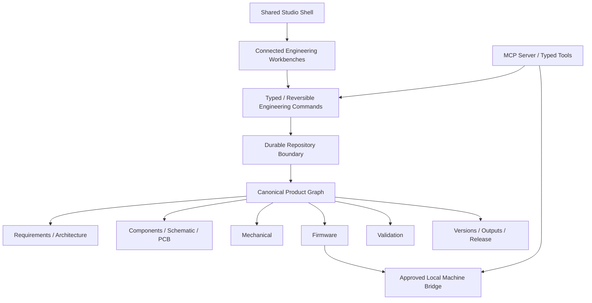

<div align="center">


# Hardware Studio

### Design the whole product—not disconnected files.

**An experimental connected engineering workspace by [Ankit Bhardwaj](https://github.com/Ankit6149)**

[Landing page](https://hardware-studio.vercel.app/) · [Studio](https://hardware-studio.vercel.app/studio) · [Current status](docs/CURRENT_STATUS.md) · [Architecture](docs/ARCHITECTURE.md) · [Roadmap](docs/ROADMAP.md)

</div>

---

> [!WARNING]
> **Hardware Studio is not a production-qualified engineering system.** Current PCB, Mechanical, Firmware, Validation, Release, drawing, and manufacturing foundations still have major engineering limitations. Do not use generated output directly for fabrication, certification, safety decisions, or production hardware without qualified independent review.

## Current snapshot — September 2, 2026

**Master at documentation sync:** `79902f6fceb0087e7f446960e9c8059841ba4daa`  
**Stable release:** None  
**Active Studio phase:** **U8 — Release convergence**

The Studio recovery program has structurally converged U0 through U7:

- U0 — architecture/navigation lock;
- U1 — shared Studio shell and clean routes;
- U2 — evidence-driven Project Home;
- U3 — connected Electronics reference workbench;
- U4 — PCB workbench convergence;
- U5 — Mechanical workbench convergence;
- U6 — Firmware workbench convergence;
- U7 — Validation **Define → Execute → Review** convergence.

U7.1 landed through PR #116. Its exact verified head passed lint, typecheck, **339/339 tests across 89 test files**, production build, and Vercel deployment status. U8 is now focused on making Release coherent and truthful.

> **Important:** “structurally converged” means the workbench uses the intended shared interaction grammar. It does **not** mean the underlying professional engineering engine is complete. Deep issues #15–#21 remain open for PCB, Mechanical, Firmware, Validation, versions/releases, and qualified outputs.

## What Hardware Studio is trying to become

Hardware development is fragmented across requirements documents, block diagrams, ECAD, CAD, firmware repositories, spreadsheets, validation reports, supplier portals, revision folders, and manufacturing packages. Relationships are often duplicated or lost between tools.

Hardware Studio explores a different mental model:

> **One product/project context with connected engineering views and one evolving digital thread.**

```text
Requirements + architecture
          ↓
Components + schematic + PCB
          ↓
Mechanical geometry + assembly context
          ↓
Firmware + hardware mapping
          ↓
Validation definitions + runs + review
          ↓
Readiness + revisions + outputs + release
```

The product is inspired by proven interaction and engineering patterns in tools such as KiCad, Altium, Autodesk Fusion, Onshape, FreeCAD, PlatformIO, NI TestStand, and PLM/release systems. It is **not currently a replacement for those tools**.

## The current Studio mental model

A user should feel:

> “I am in one product/project. Product, Electronics, PCB, Mechanical, Firmware, Validation, and Release are connected views of that same product.”

The shared Studio grammar is:

```text
TopBar
  ↓
Workbench tabs
  ↓
Contextual Project Drawer | central work surface | Inspector
                           ↓
                   bottom diagnostics/jobs/evidence dock
                           ↓
                        status bar
```

Domain workbenches should not create their own permanent navigation systems, duplicate Inspectors, or separate mini-app shells.

## Clean Studio routes

Studio navigation uses real paths rather than hash fragments:

```text
/studio
/studio/requirements
/studio/architecture
/studio/components
/studio/schematic
/studio/pcb
/studio/mechanical
/studio/firmware
/studio/validate
/studio/release
```

Nested contextual routes exist within domains. Legacy hash aliases are migration compatibility only; new code must not reintroduce hash-routed Studio navigation.

The approved public landing page is intentionally separate from Studio convergence and should not be redesigned as part of workbench recovery.

## Current workbenches

### Project / Product

Project Home, requirements, architecture, connected engineering context, next-action/blocker state, and lifecycle framing.

Project Home uses domain evidence rather than raw object counts to decide whether an area is in progress or reviewable. Durable “recent engineering changes” still depends on deeper repository/event infrastructure.

### Electronics / PCB

Connected component identity across component definitions, schematic intent, board context, PCB state, DRC/BOM surfaces, and cross-probing foundations.

**Boundary:** #15 remains open for professional ECAD depth, topology, routing, comprehensive rules/checks, multi-board guarantees, and fabrication qualification.

### Mechanical

One workbench with **2D Layout / 3D Review / Assembly** representations, shared selection, explicit physical inputs, lightweight geometry and review foundations.

**Boundary:** #16/#17 remain open for a real sketch/constraint engine, CAD kernel, parametric features, exact assemblies, exact interference/clearance, and qualified exchange.

### Firmware

One Firmware Project Drawer, module/source/hardware-map representations, shared Inspector, and bottom Problems / Build Evidence / Device Evidence grammar.

Generated source is scaffolding, not verification. Recorded build/device evidence is metadata unless the local execution chain actually ran it.

**Boundary:** #18 remains open for real filesystem operations, hardened PlatformIO build/upload, device operations, serial monitor, cancellation/recovery, and durable execution evidence.

### Validation

One Validation Project Drawer with **Tests / Coverage / Factory QA / Runs** and explicit **Define → Execute → Review** jobs.

- Define owns procedure, expected/tolerance schema, links, pass criteria, and editable definition references.
- Execute owns observation, evidence reference, reviewer/verdict, and run/retest creation.
- Review owns read-only historical run snapshots/history.

Current execution authority remains deliberately bounded: local DRC rules are local, state-machine automation is structural only, Mechanical screening is approximate, Thermal has no internal solver, and manual/physical Pass requires explicit engineer judgment/evidence.

**Boundary:** #19 remains open for durable hashed evidence, version/DUT/equipment binding, reviewer policy, execution jobs, stale propagation, and release-grade accepted evidence.

### Release — active U8 phase

Current code has readiness, revision/snapshot, output, drawing, factory-package, and release foundations. U8 is converging them into one coherent control surface.

**Critical boundary:** current foundations must not be confused with:

- content-addressed immutable versions;
- real branch ancestry and three-way merge/conflict handling;
- repository-enforced freezes;
- trusted approvals bound to exact candidate hashes;
- qualified, independently validated manufacturing artifacts;
- immutable published releases.

#20 and #21 remain the engineering authorities for those guarantees.

## At-a-glance status

| Domain | Studio structure | Engineering depth |
| --- | --- | --- |
| Product / Project Home | Converged foundation | Partial |
| Requirements / Architecture | Connected | Partial |
| Electronics / PCB | Structurally converged | Partial — #15 open |
| Mechanical | Structurally converged | Partial — #16/#17 open |
| Firmware | Structurally converged | Partial — #18 open |
| Validation | Structurally converged | Partial — #19 open |
| Release | U8 active | Foundation/partial — #20/#21 open |
| Local bridge | Foundation | Partial |
| MCP | Foundation | Partial |

Detailed classification lives in [Current Status](docs/CURRENT_STATUS.md).

## Canonical architecture direction



The current repository has pieces of this architecture, but persistence, schema normalization, command/event durability, graph semantics, backend/roles, and interoperability remain active recovery work.

## Product principles

### Truthful engineering state

Never mark a workflow complete because a type, button, test, generated file name, or status badge exists. Completion must derive from production behavior and evidence.

### Explicit context

Opening a workbench should not silently pick the first board, module, file, test, run, revision, or artifact. Canonical context should be explicit.

### One source of product truth

Each workbench should operate on the same connected project/repository model, not private copies of domain state.

### Reversible and reviewable changes

Engineering mutations should be transactional, auditable, undoable where appropriate, and eventually versioned through durable repository semantics.

### Missing data stays missing

The application must not invent authoritative dimensions, geometry, evidence, provenance, tool versions, or release identifiers merely to produce a green UI.

### Local-first direction

Local project usability and local machine/device operations remain core goals. High-impact operations should be mediated through explicit approvals and hardened local bridges.

## Run locally

### Requirements

- Node.js 22 is used in current CI;
- npm;
- PlatformIO CLI only when explicitly testing local firmware bridge foundations.

### Install and run

```bash
npm install
npm run dev
```

Open:

```text
http://localhost:3000
http://localhost:3000/studio
```

### Verify

```bash
npm run lint
npm run typecheck
npm test
npm run build
```

See [QA_CHECKLIST.md](QA_CHECKLIST.md) for the exact-head merge and truth-verification checklist.

## Repository map

```text
src/app/                     Next.js routes, metadata, landing page
src/components/              Shared shell + engineering workbenches
src/store/                   Project state, command/history and UI stores
src/lib/                     Engineering logic, validation, exports, utilities
src/types/                   Shared domain models
packages/local-bridge/       Approved local machine-operation foundation
packages/mcp-server/         MCP protocol/tooling foundation
public/                      Identity assets
docs/                        Status, architecture, plans, safety, research
.github/workflows/           Canonical CI and workflow policy
.agents/                     Agent execution guidance
```

## Documentation source-of-truth order

For current implementation work, read:

1. [Current Status](docs/CURRENT_STATUS.md)
2. [Studio Phase Execution Status](docs/development/STUDIO_PHASE_EXECUTION_STATUS.md)
3. [Product Recovery Execution Plan](docs/development/PRODUCT_RECOVERY_EXECUTION_PLAN.md)
4. [Architecture](docs/ARCHITECTURE.md)
5. [Safety and Limitations](docs/SAFETY_AND_LIMITATIONS.md)
6. domain convergence notes under `docs/development/`
7. research documents as references, not implementation-status claims.

Other useful docs:

- [Product Vision](docs/PRODUCT_VISION.md)
- [Roadmap](docs/ROADMAP.md)
- [Product Constitution](docs/product/V1_PRODUCT_CONSTITUTION.md)
- [Contributing](CONTRIBUTING.md)
- [Verification Checklist](QA_CHECKLIST.md)

## Safety and fabrication notice

Before any current generated output is used for a physical product, obtain the appropriate independent checks, which may include:

- electrical engineering review;
- mechanical/CAD review;
- CAM/Gerber/Excellon review;
- fab/assembly-house DFM review;
- verified footprints and package geometry;
- verified firmware build/device evidence;
- physical prototype validation;
- applicable safety/regulatory/certification review.

Never treat Hardware Studio's current generated output as fabrication-qualified merely because generation succeeded.

## Project status

**Stage:** research + active recovery + engineering development  
**Stable release:** none  
**Current Studio phase:** U8 Release convergence  
**Primary goal:** one truthful connected product-development environment before claiming professional replacement-level depth  
**Maintainer:** [Ankit Bhardwaj](https://github.com/Ankit6149)

---

<div align="center">


**Hardware Studio**

Building toward one connected environment for the complete physical-product lifecycle.

</div>
