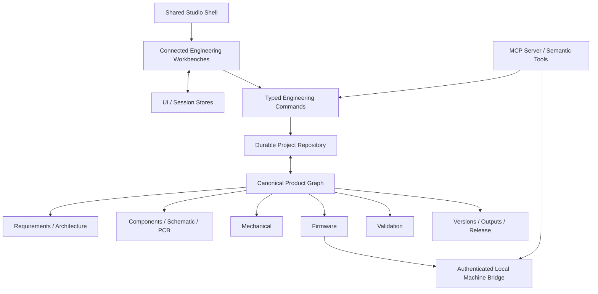

# Hardware Studio Architecture

**Architecture sync:** 2026-09-02  
**Master at sync:** `79902f6fceb0087e7f446960e9c8059841ba4daa`  
**Current Studio phase:** U8 — Release convergence

This document describes the architectural direction and the production boundaries that currently exist. It is not a claim that every target layer is complete.

## 1. Core architectural principle

Hardware Studio is one product-development environment, not a bundle of unrelated engineering mini-apps.

The user mental model is:

> I am in one product/project, and Product, Electronics, PCB, Mechanical, Firmware, Validation, and Release are connected views of that same product.

That requires two kinds of unification:

1. **interaction unification** — one predictable Studio shell and explicit context;
2. **engineering-data unification** — one canonical durable product/repository model with typed relationships and controlled derived state.

The first has progressed substantially through U0–U7. The second remains a major recovery program across #6–#12 and the domain-engine issues.

## 2. Current/target system shape



Current code contains real parts of each layer, but the durable repository, schema normalization, command coverage, graph semantics, backend/roles, and interoperability layers are not yet complete.

## 3. Shared Studio shell

The shell is now a product architecture rule, not just a visual preference.

### Shell grammar

```text
TopBar
→ workbench tabs
→ contextual Project Drawer
→ central engineering work surface
→ selection-aware Inspector
→ bottom Problems / jobs / evidence / logs dock
→ thin status bar
```

### Ownership rules

- Workbench tabs own top-level domain navigation.
- Project Drawer owns contextual project/domain navigation.
- The center owns the active user job or representation.
- Inspector owns properties/context for explicitly selected objects.
- Bottom dock owns diagnostics, operations, evidence, logs, and similar transient supporting work.
- Status bar owns compact state—not another workflow surface.

Do not create:

- another permanent domain rail;
- another workbench navigation strip inside every editor;
- duplicate Inspector/property systems;
- duplicate Problems implementations;
- center-page evidence/diagnostic mini-apps when the shared dock is the correct owner.

### Current structural convergence

U0–U7 have established this grammar across the major workbenches. U8 is applying it to Release. U9 will refine hierarchy/accessibility/responsiveness after structure stabilizes.

## 4. UI/session state vs engineering state

A major architecture boundary is **what may live outside the canonical project model**.

Appropriate UI/session state includes:

- active workbench representation;
- drawer section;
- explicit locally selected record/object;
- Inspector open/closed;
- bottom-dock tab/open state;
- temporary editor viewport/presentation state.

Examples already following this direction include Firmware and Validation workspace UI stores.

UI state must not become a second engineering source of truth.

Canonical engineering state includes requirements, components, board objects, firmware records, validation tests/runs, revisions/output records, and their relationships.

## 5. Explicit context and selection

Passive navigation must not silently invent canonical context.

Opening a workbench should not automatically choose:

- first board;
- first component;
- first module;
- first source file;
- first validation test;
- first validation run;
- first revision;
- first artifact/release record.

Explicit user selection or an intentionally persisted canonical context should drive engineering operations. Selecting a newly created object after the user explicitly created it is a different, valid interaction.

This rule prevents hidden “current object” state from diverging between editors.

## 6. Canonical product graph

The target graph is the durable connected source of engineering identity and relationships.

It should represent at least:

- project identity and schema version;
- requirements and acceptance criteria;
- architecture nodes/interfaces;
- component definitions and product-specific component instances;
- schematic symbols/pins/wires/junctions/nets;
- boards, stack/layers, outlines, placements, pads, traces, vias, drills, zones and rules;
- mechanical sketches/geometry/features/parts/assemblies/dimensions/constraints;
- firmware modules, mappings, source/configuration/build/device records;
- validation definitions, runs, measurements, evidence, reviewer decisions and lineage;
- versions/workspaces/branches/comparisons/merge conflicts/candidates/releases;
- drawings/manufacturing/output recipes, jobs, artifacts, hashes and qualification;
- proposals/audit events/MCP operations;
- dependency and stale-state relationships.

### Current limitation

The current `Project`/store architecture still contains overlapping legacy/new representations and broad optional state. #6, #11/#42, #12 and related recovery work remain open. Do not document the current model as a finished canonical graph merely because cross-workbench identity has improved.

## 7. Command and transaction architecture

Meaningful engineering mutations should converge on typed commands rather than arbitrary component-local state writes.

A mature command/event record should support:

- stable command type;
- actor/source;
- affected domain/object IDs;
- exact before/after data or reversible operation representation;
- validation result;
- stale/impact propagation;
- time and repository revision;
- approval context where required.

Pointer transactions should use:

```text
begin
→ transient preview
→ commit once
→ persist
→ propagate affected/stale state
```

Undo must restore exact committed prior state; redo must restore exact final state.

#8/#39 and repository/event work remain open because not every domain mutation has reached this architecture.

## 8. Repository and persistence boundary

The long-term project repository must be usable consistently by:

- browser UI;
- local services/bridge;
- MCP process;
- future collaboration/backend layers;
- release/output jobs.

Browser `localStorage` or a monolithic Zustand store cannot be the final cross-process engineering repository.

Target properties include:

- schema/version-aware load/save;
- deterministic migrations;
- transaction boundaries;
- corruption/recovery behavior;
- project/workspace identity;
- conflict/revision checks;
- event/audit history;
- blob/artifact handling;
- eventually cloud/local parity without sacrificing local ownership.

#7/#38 and related backend work remain active.

## 9. Domain-engine architecture and current authority

### Product / requirements / architecture

Responsibilities:

- requirements and acceptance criteria;
- architecture/interfaces;
- traceability;
- impact/risk/decision context;
- linked validation coverage.

Current UI foundations exist. Full graph/lifecycle/impact semantics still depend on recovery work.

### Electronics / schematic / PCB

Responsibilities:

- canonical component/pin/net identity;
- schematic connectivity/ERC;
- board identity/stack/outline;
- footprint/pad placement;
- routing/connectivity graph;
- zones/keepouts/rules;
- DRC;
- qualified board-derived outputs.

Current structural workbench is coherent, but #15 remains open for professional ECAD depth. Current local DRC does not imply comprehensive industry-grade verification.

### Mechanical

Responsibilities:

- sketch topology;
- dimensions/constraints;
- exact parametric feature model;
- parts/bodies/assemblies/mates;
- board/package coordination;
- exact interference/clearance;
- drawings/export derived from exact geometry.

Current 2D and 3D review foundations are not a CAD-kernel authority. #16/#17 remain open.

### Firmware

Responsibilities:

- source/configuration;
- generated/user-authored file distinctions;
- hardware mapping;
- behavior/state machine;
- reproducible build environment;
- build artifacts/logs;
- upload/device/serial operations;
- durable evidence tied to exact source/environment/device.

The UI is structurally converged, but #18 remains open for real filesystem/PlatformIO/device/serial execution infrastructure.

### Validation

Responsibilities:

- definition/procedure/criteria;
- execution jobs;
- observed measurements/results;
- evidence/provenance;
- reviewer decisions;
- append-only run/retest lineage;
- requirement coverage;
- stale propagation and release gating.

U7 established one **Define → Execute → Review** UX grammar and explicit test/run selection. Current local execution authority remains intentionally bounded. #19 remains open for durable evidence, equipment/DUT/version binding, trusted review, long-running execution and release-grade lineage.

### Versions / Release

Responsibilities:

- editable workspace identity;
- immutable named versions/content trees;
- branch ancestry;
- comparisons;
- three-way merges/conflicts;
- freeze policy;
- release candidates tied to exact versions/artifacts;
- trusted approvals;
- immutable releases and supersession/withdrawal.

U8 is currently converging the UI. #20 remains open for the real engine.

### Outputs / drawings / manufacturing

Responsibilities:

- recipes tied to exact canonical inputs;
- deterministic generation jobs;
- drawings based on qualified exact geometry;
- board outputs based on authoritative topology/geometry;
- firmware/validation reports tied to immutable evidence;
- provenance/tool/input/output hashes;
- independent parser/viewer/preflight checks;
- review/approval bound to exact manifest;
- content-addressed artifacts integrated with release.

#21 remains open. A generated file is not a qualified artifact.

## 10. Validation execution authority

Current local validation modes are explicitly limited:

- DRC automation: implemented local PCB rules only;
- firmware-state automation: structural state-machine validation only;
- Mechanical: approximate local AABB screening; clean screen is not exact CAD clearance proof;
- Thermal: no internal solver; external simulation/lab evidence and reviewer are required for a verdict;
- other manual/physical tests: explicit engineer verdict required.

This authority boundary is architectural because Release/readiness code must not infer stronger evidence than Validation actually produced.

## 11. Local bridge

Machine operations belong behind an authenticated local bridge rather than arbitrary browser command execution.

Security properties should include:

- loopback-only binding;
- session authentication;
- strict origin policy;
- canonical workspace root and path containment;
- argument-array spawning rather than shell strings;
- operation-scoped approvals for high-impact actions;
- explicit target/device/port binding;
- lifecycle records, cancellation/recovery and logs.

Current foundations exist; #18 and security/repository work remain active.

## 12. MCP architecture

MCP should expose semantic engineering operations over the same canonical repository/command layer as the UI.

Desired categories:

- **read** — inspect product/domain state;
- **draft** — create reversible proposals without immediate mutation;
- **apply/control** — apply reviewed proposal, undo/revert where supported;
- **high impact** — device/release/destructive operations behind explicit approval/policy.

MCP must never gain authority to fabricate geometry, placement, evidence, qualification or human approval.

Current MCP protocol/tool foundations exist; complete live durable repository integration and policy remain recovery work.

## 13. Derived state and staleness

Readiness, validation acceptance, outputs and release eligibility must derive from real dependencies.

Examples of blockers/stale conditions include:

- unresolved requirement/interface;
- ERC/DRC blocker;
- unrouted/unresolved connectivity;
- invalid/missing board or package geometry;
- mechanical collision or unresolved exact-clearance evidence;
- failed/missing firmware build/device evidence;
- failed/missing critical validation evidence;
- source change after validation/output generation;
- stale drawing/manufacturing artifact;
- missing qualification/reviewer/approval;
- release candidate referencing changed dependencies.

An empty array, existing screen, generated file, or status badge is not evidence of readiness.

## 14. Current structural phase state

| Studio phase | Architecture state |
| --- | --- |
| U0 | Architecture/navigation lock landed |
| U1 | Shared shell foundation landed |
| U2 | Evidence-driven Project Home landed |
| U3 | Electronics structural convergence landed |
| U4 | PCB structural convergence landed |
| U5 | Mechanical structural convergence landed |
| U6 | Firmware structural convergence landed |
| U7 | Validation structural convergence landed |
| **U8** | **Active — Release convergence** |
| U9 | Deferred final polish |

See `docs/development/STUDIO_PHASE_EXECUTION_STATUS.md` for exact PR/commit evidence and current next action.

## 15. Architecture completion rule

Do not call an architecture layer complete because the UI uses the intended shape. Completion requires the relevant issue acceptance criteria, production engine, persistence/repository behavior, tests, failure/recovery semantics, provenance, independent verification where needed, and end-to-end workflow evidence.

For current implementation reality, defer to [`CURRENT_STATUS.md`](CURRENT_STATUS.md).
