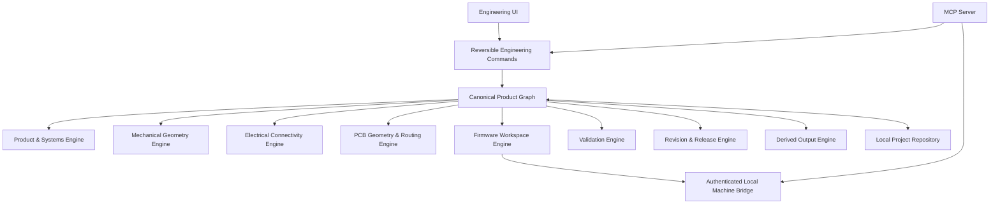

# Hardware Studio Architecture

## Status

This document describes the intended architecture and the foundations currently present in the repository. It is not a claim that every subsystem is complete.

## Architectural goal

Every Hardware Studio workbench, importer, AI/MCP action, and engineering engine must resolve against the same canonical product graph and repository. A user may begin from any supported artifact or discipline; architecture must not require an upstream workbench to exist merely because implementation was built in that order.



## Product architecture principles

### Start anywhere

Project creation and enrichment use a common adoption pipeline:

```
source artifact / native authoring
        ↓
inspect + fingerprint
        ↓
parse / classify semantics
        ↓
map source identity
        ↓
preview unresolved/lossy/conflicting state
        ↓
typed commands
        ↓
canonical graph + repository
```

Importers never own a second product model. Re-import reconciliation uses preserved source identities and explicit conflict resolution. See #120.

### One object, many representations

Canonical entities may be projected into multiple views:

```
canonical component / part / board / requirement / test
        ├─ architecture representation
        ├─ schematic representation
        ├─ PCB representation
        ├─ mechanical package / exact CAD
        ├─ lightweight 3D render cache
        ├─ firmware mapping
        └─ validation / release context
```

Representation objects contain view/render data and stable references back to canonical identity. They do not become alternate engineering authorities.

### Universal engineering context

Workbench navigation follows canonical object identity through #122.

Routing, tabs, drawer, inspector, search, diagnostics and deep links may store UI/session context, but canonical engineering payloads remain in repository/query services.

### Engineering engine runtime

External/native tools integrate through #121:

```
Hardware Studio application
        ↓
engine capability registry + durable job
        ↓
secure local agent / browser WASM / remote qualified service
        ↓
KiCad | OCCT/FreeCAD | PlatformIO | OpenOCD/GDB | ngspice | validators
        ↓
artifacts + diagnostics + qualification evidence
        ↓
repository registration / typed follow-up commands
```

An engine may produce evidence/artifacts but may not bypass typed commands to mutate canonical state.

### Rendering and exact-geometry boundary

Target hypotheses, subject to #35 ADR evidence:

- React Flow: semantic architecture/system graphs.
- PixiJS/WebGL-class retained 2D scene graph: dense schematic/PCB surfaces.
- Three.js: interactive glTF/GLB visualization, picking, clipping and assembly views.
- OCCT/Open CASCADE: exact B-Rep/mechanical geometry authority.
- KiCad/`kicad-cli`: ECAD interchange, independent ERC/DRC and supported manufacturing/3D exports.
- Monaco + xterm.js: firmware/code and console UI.
- IndexedDB/repository metadata + OPFS/content-addressed blobs: durable local artifacts.

Renderer coordinates, meshes and UI layout remain projections. Exact engineering geometry/topology is owned by the appropriate canonical domain/kernel/source representation.

### Capability-based readiness

Readiness is computed from domain facts, qualification and evidence, not from completing workbenches in order.

A missing prerequisite blocks only operations that actually depend on it.

## Core layers

### 1. Canonical product graph

The graph is the durable source of engineering state. It should include:

- project identity and schema version
- product requirements
- architecture nodes and interfaces
- mechanical objects, dimensions, constraints, bodies, and assemblies
- component definitions and component instances
- schematic symbols, pins, wires, junctions, and nets
- boards, layers, outlines, placements, traces, vias, drills, zones, and rules
- firmware configuration, modules, states, mappings, files, and build records
- validation tests, runs, measurements, evidence, and approvals
- revisions, branches, release candidates, releases, and manifests
- MCP proposals and audit records
- generated-output state and staleness

No workbench should maintain an unrelated private version of the same product data.

### 2. Command layer

All meaningful changes should pass through typed engineering commands.

A command should capture:

- command type
- author or source
- affected domain
- before state
- after state
- affected object IDs
- validation result
- stale derived outputs
- timestamp
- approval information when required

Pointer interactions should use a transaction lifecycle:

```text
begin command
→ update transient preview
→ commit once
→ persist
→ mark derived artifacts stale
```

Cancellation should restore exact pointer-down state. Undo and redo should restore exact committed states.

### 3. Product and systems engine

Responsibilities:

- requirements
- architecture
- interfaces
- risks
- traceability
- change impact
- requirement coverage

### 4. Mechanical geometry engine

Responsibilities:

- 2D geometry
- object transforms
- dimensions
- lightweight constraints
- assembly bodies
- board/enclosure synchronization
- collision and clearance calculations
- future parametric geometry

The current repository contains early 2D and WebGL foundations. It is not a production CAD kernel.

### 5. Electrical connectivity engine

Responsibilities:

- components and electrical pins
- schematic anchors
- wires and junctions
- nets and labels
- ERC
- component deletion and replacement impact

Electrical connectivity should be represented structurally, not inferred from display coordinates or concatenated strings.

### 6. PCB geometry and routing engine

Responsibilities:

- active-board isolation
- board outlines and layers
- footprints and pads
- placements
- route anchors
- traces and vias
- connectivity graph
- copper zones and keepouts
- DRC
- selected-board manufacturing outputs

A routed net should be considered complete only when every assigned pad belongs to the same connected electrical graph.

### 7. Firmware workspace engine

Responsibilities:

- project configuration
- source tree
- generated and user-authored files
- hardware mappings
- state machines
- PlatformIO configuration
- builds and artifacts
- upload and serial operations

The browser should not execute arbitrary local commands. Machine actions belong behind the local bridge.

### 8. Validation engine

Responsibilities:

- test definitions
- execution runs
- measurements and tolerances
- evidence
- reviewer decisions
- retests
- immutable history
- requirement coverage
- release blocking

Unsupported or manual tests must never auto-pass.

### 9. Revision and release engine

Responsibilities:

- named revisions
- branches
- state restoration
- comparisons
- merge conflicts
- release candidates
- approvals
- immutable released snapshots
- release manifests

A released snapshot should remain immutable while allowing a new working branch to be created from it.

### 10. Derived output engine

Responsibilities:

- blueprints
- BOM and CPL
- board drafts
- firmware packages
- validation reports
- readiness summaries
- release manifests
- checksums

Derived outputs must be marked stale whenever their dependencies change.

Generated manufacturing output must remain explicitly labelled as draft until independently reviewed.

## Local project repository

The long-term repository layer should be usable by both the browser application and Node-based processes such as the MCP server.

Possible architecture:

```text
Browser UI
   ↓ authenticated local RPC
Local canonical project repository
   ↑
MCP stdio process
```

Browser-only localStorage cannot be the final shared source for MCP and machine operations.

## MCP server

The MCP server should expose only implemented tools and resources.

### Tool categories

#### Read

- get current project
- get requirements
- get architecture
- get mechanical layout
- get schematic
- get PCB status
- get firmware workspace
- get validation status
- get revision and release state

#### Draft

- draft requirement
- draft architecture change
- draft component replacement
- draft schematic connection
- draft PCB change
- draft firmware change
- draft validation test

#### Apply and control

- apply draft
- reject draft
- undo last change

#### High impact

- delete critical component
- change board outline
- upload firmware
- approve release

High-impact operations require explicit, scoped approval.

## Local bridge

The local bridge is responsible for approved machine operations.

Security requirements:

- loopback-only binding
- mandatory session token
- strict origin allowlist
- canonical workspace root
- path containment validation
- argument-array process spawning
- no arbitrary shell endpoint
- short-lived, operation-scoped approvals
- operation history
- cancellation

Target operations include:

- PlatformIO detection
- builds
- serial-port listing
- firmware upload
- serial monitor
- workspace export
- blueprint export

## Persistence and migrations

Every persisted project should include a schema version.

Migrations should:

- preserve known data
- convert legacy representations
- avoid silently discarding unknown V1 fields
- validate structural integrity
- produce actionable warnings

Round-trip tests should cover export, reset, import, project switching, and reload.

## Derived-state truthfulness

Readiness, validation, release eligibility, and manufacturing status must derive from actual project state.

Examples of real blockers:

- unresolved critical requirement
- ERC or DRC error
- unrouted net
- invalid route anchor
- component outside board
- missing package dimensions
- mechanical collision
- failed firmware build
- failed critical validation run
- stale blueprint
- stale manufacturing package
- missing approval

An empty array or existing UI panel is not proof of readiness.

## Current architectural limitations

The current repository still has gaps in:

- shared durable storage between browser and MCP
- complete command integration across all canvases
- PCB connectivity and strict multi-board isolation
- parametric mechanical geometry
- complete local bridge operations
- validation execution UI
- branch and release integration
- fabrication-grade outputs

See [CURRENT_STATUS.md](CURRENT_STATUS.md) for the maintained status summary.
